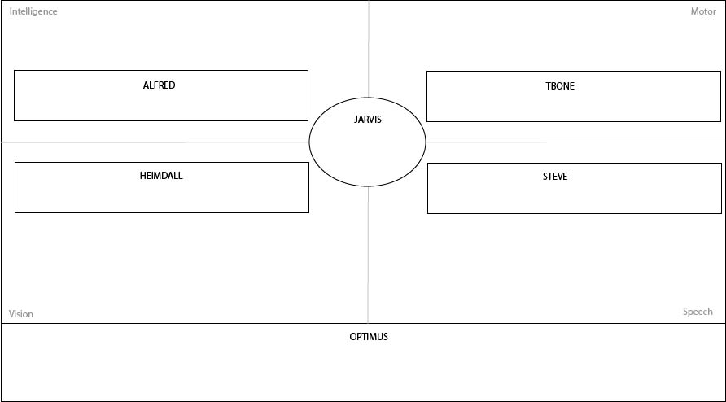

# AIOS

Aritificially Intelligent Operating system. Pronounced as `aye-os`

# Description

An operating system aimed to run on any machine with inbuilt intelligent capabilities. 

List of few inbuilt capabilities may be
* Speech recognition
* Computer vision
* SLAM

Roadmap folder contains more information on the timeline of the project.

# Architecture

